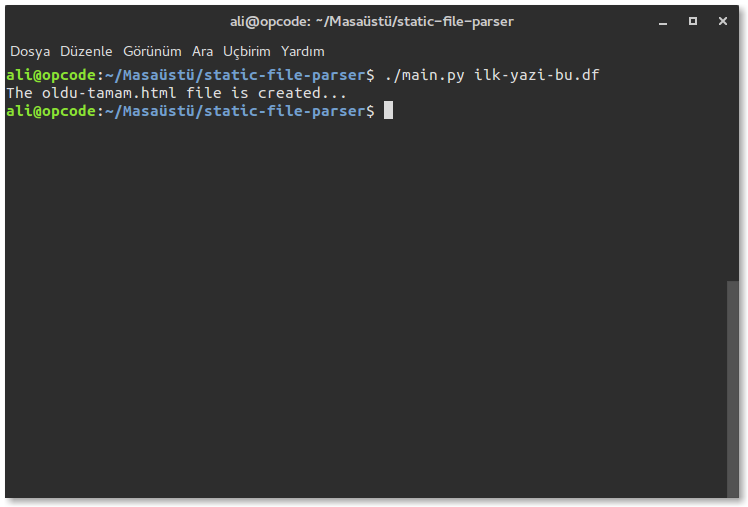
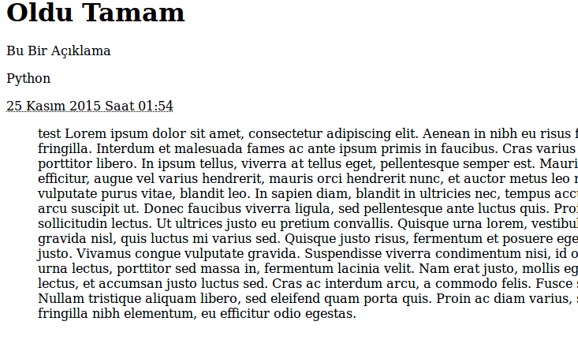

#Static File Parser

Static File Parser, static site generatorlerdeki gibi çalışma durumuna sahip. Eğer çalışma mantıklarını biliyorsanız hiç yabancı değilsiniz demektir. Tabii bu repo benim denemelerimi içereceği için octopress, nikola ya da jekyll gibi über şeyler aklınıza gelmesin :) Ben Sadece regex öğrenmeye çalışıyorum :)

#Nasıl?

Öncelikle bir dosyayı ayrıştırıp, HTML haline getirme işlemi:

```shell

./main.py ilk-yazi-bu.df

```

Eğer dosya uzantısı **.df** değil ise hata verecektir. İşlenmeyi bekleyen dosyaların kemik yapısı ise:

```md
[title=Bu Bir Başlık] => Çıktı olarak **Bu Bir Başlık** şeklinde görülecektir.

[description=Bu Bir Açıklama] => Çıktı olarak **Bu Bir Açıklama** şeklinde görülecektir.

[category=Python] => Çıktı olarak **Python** şeklinde görülecektir. Eğer kategori boş olarak gönderilirse **Uncategorized** olacaktır.

[date=25 Kasım 2015 Saat 01:54] => Çıktı olarak **25 Kasım 2015 Saat 01:54** şeklinde görülecektir. Bu manuel tarih gösterimidir. Eğer **now** tagini kullanırsanız sistem saatinizi alır. Örneğin:

[date=now] => Bu kullanımla sistem saatiniz alınır.

[content]
Bu tagler arasında ise içerik konusu yani makale konusu yer almaktadır. Yazılar buradadır.
[/content]

```

Oluşturulan dosyalar html dosyalarıdır. Dosya adları ise başlıktan alınmaktadır. örneğin `[title=Bu Acayip Bence]` gibi bir başlıktan oluşan dosya `bu-acayip-bence.html` olarak çıkacaktır. Ben '[title=Oldu Tamam]' şeklinde kullanmıştım. O şöyle bir çıktı verdi:

#Ekran Görüntüleri

**Konsoldan çalıştırma**



**Çıktısı Alınan HTML sayfası**



*HTML kodları da yine bu repo içerisindedir. Ornekler dizininde bulabilirsiniz.*
